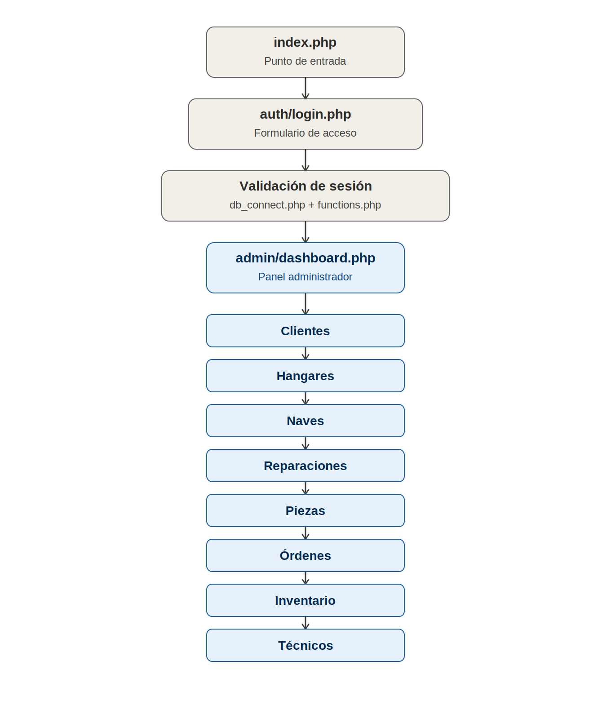

# NEXUS STELLAR SHIPYARDS

Este proyecto es un sistema web de gestión para un taller espacial, con acceso administrativo. Incluye control de hangares, naves, reparaciones, inventario y estadísticas.

## 1. Distribución visual del proyecto:

```
final/
├── admin/
│   ├── clientes.php
│   ├── dashboard.php
│   ├── hangares.php
│   ├── inventario.php
│   ├── naves.php
│   ├── ordenes.php
│   ├── piezas.php
│   ├── reparaciones.php
│   └── tecnicos.php
├── api/
│   ├── get_alertas.php
│   └── get_stats.php
├── auth/
│   ├── login.php
│   └── logout.php
├── includes/
│   ├── db_connect.php
│   ├── footer.php
│   ├── functions.php
│   ├── header.php
│   └── sidebar_admin.php
├── assets/
│   ├── css/
│   │   └── style.css
│   ├── images/
│   │   ├── avatars/
│   │   ├── backgrounds/
│   │   ├── parts/
│   │   └── ships/
│   └── js/
│       └── main.js
├── database.sql
└── index.php
```
---

## 2. Flujo del programa

- Administrador: inicia sesión en `auth/login.php`, accede al panel `admin/dashboard.php`, y desde allí gestiona clientes, hangares, naves, reparaciones, piezas, órdenes, inventario y técnicos.

Flujo visual del programa:



---

## 3. Credenciales de Prueba

| Usuario      | Contraseña |
|--------------|------------|
| admin        | password   |

---

## 4. Arquitectura y Tecnologías Utilizadas

El sistema se distribuye internamente en tres capas principales:

- **Backend (Servidor)**: Implementado en PHP 7.4+ usando PDO para acceso a la base de datos. La lógica de negocio y control de sesiones reside en `includes/` y en las páginas dentro de `admin/`.
- **API interna**: Endpoints en `api/` (`get_stats.php`, `get_alertas.php`) exponen datos para consultas dinámicas; son consumidos vía AJAX desde el frontend para actualizar indicadores y alertas en tiempo real.
- **Frontend (Cliente)**: HTML/CSS con estilos apoyados por Tailwind CDN, JavaScript Vanilla para la interacción y `Chart.js` para visualización de métricas y gráficos.
- **Base de Datos**: MySQL / MariaDB según `database.sql` — almacenamiento de usuarios, naves, reparaciones, piezas y transacciones.

Esta separación facilita mantenimiento, escalado y pruebas: el backend atiende peticiones y reglas, la API ofrece datos estructurados, y el frontend consume y presenta la información.

---

## 5. Seguridad

El sistema gestiona la seguridad y las restricciones de acceso a través de:

- **Control estricto de sesiones**: El flujo de autenticación centraliza la validación en `auth/login.php` y funciones de `includes/functions.php` (`requireAuth()`, `requireAdmin()`), verificando sesión y rol antes de permitir el acceso a rutas administrativas.
- **Regeneración de sesión**: Tras el login se recomienda (y se implementa en el flujo) `session_regenerate_id(true)` para mitigar secuestro de sesión.
- **Prevención de inyección SQL**: Todas las interacciones con la base de datos utilizan PDO con sentencias preparadas, evitando concatenación directa de entradas del usuario.
- **Sanitización y escape de salida**: Entradas se validan y se sanitizan en puntos de entrada; las salidas que se muestran en HTML se escapan usando `htmlspecialchars()` para prevenir XSS.
- **Acceso por rol en cada página**: Las páginas sensibles comprueban el rol en la cabecera y redirigen si no hay permisos, evitando accesos por URL directa.

---

## 6. Tecnologías Utilizadas

- **Capa Servidor**: PHP 7.4+ (PDO para persistencia segura de datos).
- **Almacenamiento**: MySQL / MariaDB (Esquema relacional optimizado).
- **Diseño de Interfaz**: HTML5, CSS3 nativo, Tailwind CSS (vía CDN para estilos dinámicos).
- **Componentes Dinámicos**: Vanilla JavaScript (ES6+), Chart.js (Librería gráfica para estadísticas).
- **Recursos Visuales**: Google Fonts (Orbitron, Exo 2), iconos incrustados mediante SVG nativo (cero dependencias externas).

---

## 7. Autoría y Créditos

Proyecto desarrollado como trabajo final para la asignatura de Programación Web, Facultad de Informática, Electrónica y Comunicación (FIEC), Universidad de Panamá (Semestre 2026).

- **Desarrolladores**: Luis Lee, Juan Campos, Ariel Leones y Yassir Batista
- **Profesor**: Nelson Montilla

---
